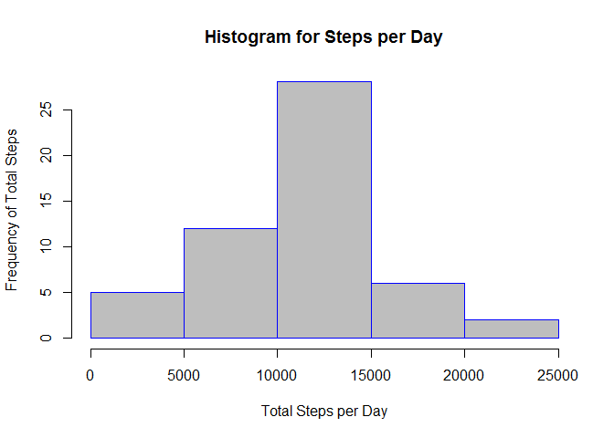
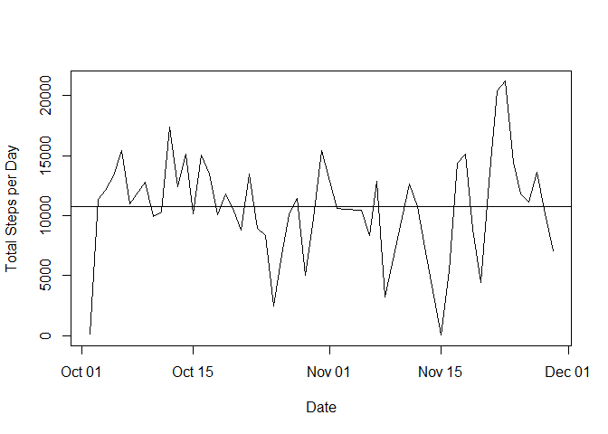
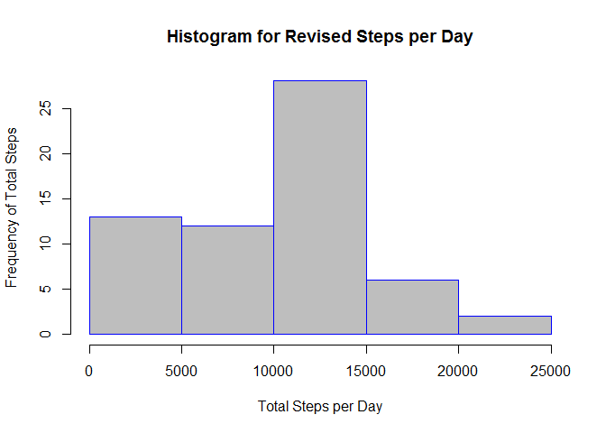
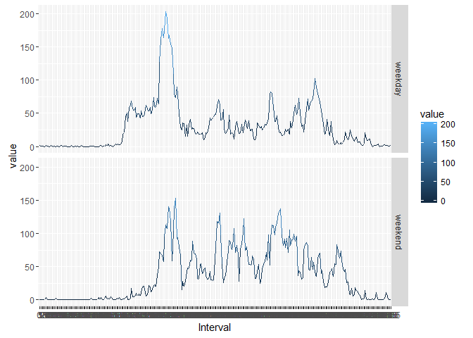

# Reproducible Research: Peer Assessment 1


## Loading and preprocessing the data

First, we check to see if the zip file is still there. If it is, we extract the contents of the zip file to make sure we are working from the original activity.csv file.


```r
if(!file.exists("./activity.zip")){unzip("./activity.zip", overwrite = TRUE)}
activity <- read.csv("activity.csv", stringsAsFactors = FALSE)
```

## What is mean total number of steps taken per day?

The total number of steps per day is stored in our variable steps_per_day (Note: this is a little long as there are two months worth of data here):


```r
na.omit(aggregate(activity$steps, by=list(Date=activity$date), FUN=sum))
```

```
##          Date     x
## 2  2012-10-02   126
## 3  2012-10-03 11352
## 4  2012-10-04 12116
## 5  2012-10-05 13294
## 6  2012-10-06 15420
## 7  2012-10-07 11015
## 9  2012-10-09 12811
## 10 2012-10-10  9900
## 11 2012-10-11 10304
## 12 2012-10-12 17382
## 13 2012-10-13 12426
## 14 2012-10-14 15098
## 15 2012-10-15 10139
## 16 2012-10-16 15084
## 17 2012-10-17 13452
## 18 2012-10-18 10056
## 19 2012-10-19 11829
## 20 2012-10-20 10395
## 21 2012-10-21  8821
## 22 2012-10-22 13460
## 23 2012-10-23  8918
## 24 2012-10-24  8355
## 25 2012-10-25  2492
## 26 2012-10-26  6778
## 27 2012-10-27 10119
## 28 2012-10-28 11458
## 29 2012-10-29  5018
## 30 2012-10-30  9819
## 31 2012-10-31 15414
## 33 2012-11-02 10600
## 34 2012-11-03 10571
## 36 2012-11-05 10439
## 37 2012-11-06  8334
## 38 2012-11-07 12883
## 39 2012-11-08  3219
## 42 2012-11-11 12608
## 43 2012-11-12 10765
## 44 2012-11-13  7336
## 46 2012-11-15    41
## 47 2012-11-16  5441
## 48 2012-11-17 14339
## 49 2012-11-18 15110
## 50 2012-11-19  8841
## 51 2012-11-20  4472
## 52 2012-11-21 12787
## 53 2012-11-22 20427
## 54 2012-11-23 21194
## 55 2012-11-24 14478
## 56 2012-11-25 11834
## 57 2012-11-26 11162
## 58 2012-11-27 13646
## 59 2012-11-28 10183
## 60 2012-11-29  7047
```

Creating a histogram to show the frequency of the total steps per day:


```r
steps_per_day <- na.omit(aggregate(activity$steps, by=list(Date=activity$date), FUN=sum))
steps_per_day$Date <- as.Date(steps_per_day$Date)
hist(steps_per_day$x,  main="Histogram for Steps per Day", xlab="Total Steps per Day", ylab="Frequency of Total Steps", border="blue", col="gray")
```

 

And now for the mean and median steps per day:


```r
na.omit(aggregate(steps_per_day$x, by=list(Date=steps_per_day$Date), FUN=mean, na.rm = TRUE))
```

```
##          Date     x
## 1  2012-10-02   126
## 2  2012-10-03 11352
## 3  2012-10-04 12116
## 4  2012-10-05 13294
## 5  2012-10-06 15420
## 6  2012-10-07 11015
## 7  2012-10-09 12811
## 8  2012-10-10  9900
## 9  2012-10-11 10304
## 10 2012-10-12 17382
## 11 2012-10-13 12426
## 12 2012-10-14 15098
## 13 2012-10-15 10139
## 14 2012-10-16 15084
## 15 2012-10-17 13452
## 16 2012-10-18 10056
## 17 2012-10-19 11829
## 18 2012-10-20 10395
## 19 2012-10-21  8821
## 20 2012-10-22 13460
## 21 2012-10-23  8918
## 22 2012-10-24  8355
## 23 2012-10-25  2492
## 24 2012-10-26  6778
## 25 2012-10-27 10119
## 26 2012-10-28 11458
## 27 2012-10-29  5018
## 28 2012-10-30  9819
## 29 2012-10-31 15414
## 30 2012-11-02 10600
## 31 2012-11-03 10571
## 32 2012-11-05 10439
## 33 2012-11-06  8334
## 34 2012-11-07 12883
## 35 2012-11-08  3219
## 36 2012-11-11 12608
## 37 2012-11-12 10765
## 38 2012-11-13  7336
## 39 2012-11-15    41
## 40 2012-11-16  5441
## 41 2012-11-17 14339
## 42 2012-11-18 15110
## 43 2012-11-19  8841
## 44 2012-11-20  4472
## 45 2012-11-21 12787
## 46 2012-11-22 20427
## 47 2012-11-23 21194
## 48 2012-11-24 14478
## 49 2012-11-25 11834
## 50 2012-11-26 11162
## 51 2012-11-27 13646
## 52 2012-11-28 10183
## 53 2012-11-29  7047
```

```r
na.omit(aggregate(steps_per_day$x, by=list(Date=steps_per_day$Date), FUN=median, na.rm = TRUE))
```

```
##          Date     x
## 1  2012-10-02   126
## 2  2012-10-03 11352
## 3  2012-10-04 12116
## 4  2012-10-05 13294
## 5  2012-10-06 15420
## 6  2012-10-07 11015
## 7  2012-10-09 12811
## 8  2012-10-10  9900
## 9  2012-10-11 10304
## 10 2012-10-12 17382
## 11 2012-10-13 12426
## 12 2012-10-14 15098
## 13 2012-10-15 10139
## 14 2012-10-16 15084
## 15 2012-10-17 13452
## 16 2012-10-18 10056
## 17 2012-10-19 11829
## 18 2012-10-20 10395
## 19 2012-10-21  8821
## 20 2012-10-22 13460
## 21 2012-10-23  8918
## 22 2012-10-24  8355
## 23 2012-10-25  2492
## 24 2012-10-26  6778
## 25 2012-10-27 10119
## 26 2012-10-28 11458
## 27 2012-10-29  5018
## 28 2012-10-30  9819
## 29 2012-10-31 15414
## 30 2012-11-02 10600
## 31 2012-11-03 10571
## 32 2012-11-05 10439
## 33 2012-11-06  8334
## 34 2012-11-07 12883
## 35 2012-11-08  3219
## 36 2012-11-11 12608
## 37 2012-11-12 10765
## 38 2012-11-13  7336
## 39 2012-11-15    41
## 40 2012-11-16  5441
## 41 2012-11-17 14339
## 42 2012-11-18 15110
## 43 2012-11-19  8841
## 44 2012-11-20  4472
## 45 2012-11-21 12787
## 46 2012-11-22 20427
## 47 2012-11-23 21194
## 48 2012-11-24 14478
## 49 2012-11-25 11834
## 50 2012-11-26 11162
## 51 2012-11-27 13646
## 52 2012-11-28 10183
## 53 2012-11-29  7047
```

## What is the average daily activity pattern?

First, let's see a plot of the daily steps along with an average of the steps per day:


```r
plot(steps_per_day, type = "l", ylab="Total Steps per Day")
abline(h=mean(steps_per_day$x))
```

 

Next, let's calculate which 5 minute interval contains the maximum number of steps taken (during which 5 minute interval was the most walking seen?):


```r
na.omit(activity[activity$steps == max(activity$steps, na.rm = TRUE),])
```

```
##       steps       date interval
## 16492   806 2012-11-27      615
```

From this result, we can see the time interval in question happened on 27 November at 6:15 AM.

## Imputing missing values

Next we are counting the number of NA rows in our dataset.


```r
sum(is.na(activity$steps))
```

```
## [1] 2304
```

Based on the result, it looks like we have 2304 rows with missing data. Next we have to fill those missing data with the mean for those intervals and store the new resulting data in a new dataset.


```r
revised_activity <- activity
revised_activity$date <- as.Date(revised_activity$date)
uniques <- unique(revised_activity[c("steps", "interval")])
uniques <- uniques[!is.na(uniques$steps),]

na.steps <- which(is.na(revised_activity$steps))
na.interval <- revised_activity$interval[na.steps]
revised_activity[is.na(revised_activity$steps), "steps"] <- uniques$steps[match(na.interval, uniques$interval)]
```

And now let's make a histogram of this new dataset:


```r
revised_steps_per_day <- na.omit(aggregate(revised_activity$steps, by=list(Date=revised_activity$date), FUN=sum))
revised_steps_per_day$Date <- as.Date(revised_steps_per_day$Date)
hist(revised_steps_per_day$x,  main="Histogram for Revised Steps per Day", xlab="Total Steps per Day", ylab="Frequency of Total Steps", border="blue", col="gray")
```

 

Notice that the histogram is very different in the low end of step counts due to the changes we introduced by substituing the mean in for previously NA values.

And the mean and median for this new dataset:


```r
na.omit(aggregate(revised_steps_per_day$x, by=list(Date=revised_steps_per_day$Date), FUN=mean, na.rm = TRUE))
```

```
##          Date     x
## 1  2012-10-01   126
## 2  2012-10-02   126
## 3  2012-10-03 11352
## 4  2012-10-04 12116
## 5  2012-10-05 13294
## 6  2012-10-06 15420
## 7  2012-10-07 11015
## 8  2012-10-08   126
## 9  2012-10-09 12811
## 10 2012-10-10  9900
## 11 2012-10-11 10304
## 12 2012-10-12 17382
## 13 2012-10-13 12426
## 14 2012-10-14 15098
## 15 2012-10-15 10139
## 16 2012-10-16 15084
## 17 2012-10-17 13452
## 18 2012-10-18 10056
## 19 2012-10-19 11829
## 20 2012-10-20 10395
## 21 2012-10-21  8821
## 22 2012-10-22 13460
## 23 2012-10-23  8918
## 24 2012-10-24  8355
## 25 2012-10-25  2492
## 26 2012-10-26  6778
## 27 2012-10-27 10119
## 28 2012-10-28 11458
## 29 2012-10-29  5018
## 30 2012-10-30  9819
## 31 2012-10-31 15414
## 32 2012-11-01   126
## 33 2012-11-02 10600
## 34 2012-11-03 10571
## 35 2012-11-04   126
## 36 2012-11-05 10439
## 37 2012-11-06  8334
## 38 2012-11-07 12883
## 39 2012-11-08  3219
## 40 2012-11-09   126
## 41 2012-11-10   126
## 42 2012-11-11 12608
## 43 2012-11-12 10765
## 44 2012-11-13  7336
## 45 2012-11-14   126
## 46 2012-11-15    41
## 47 2012-11-16  5441
## 48 2012-11-17 14339
## 49 2012-11-18 15110
## 50 2012-11-19  8841
## 51 2012-11-20  4472
## 52 2012-11-21 12787
## 53 2012-11-22 20427
## 54 2012-11-23 21194
## 55 2012-11-24 14478
## 56 2012-11-25 11834
## 57 2012-11-26 11162
## 58 2012-11-27 13646
## 59 2012-11-28 10183
## 60 2012-11-29  7047
## 61 2012-11-30   126
```

```r
na.omit(aggregate(revised_steps_per_day$x, by=list(Date=revised_steps_per_day$Date), FUN=median, na.rm = TRUE))
```

```
##          Date     x
## 1  2012-10-01   126
## 2  2012-10-02   126
## 3  2012-10-03 11352
## 4  2012-10-04 12116
## 5  2012-10-05 13294
## 6  2012-10-06 15420
## 7  2012-10-07 11015
## 8  2012-10-08   126
## 9  2012-10-09 12811
## 10 2012-10-10  9900
## 11 2012-10-11 10304
## 12 2012-10-12 17382
## 13 2012-10-13 12426
## 14 2012-10-14 15098
## 15 2012-10-15 10139
## 16 2012-10-16 15084
## 17 2012-10-17 13452
## 18 2012-10-18 10056
## 19 2012-10-19 11829
## 20 2012-10-20 10395
## 21 2012-10-21  8821
## 22 2012-10-22 13460
## 23 2012-10-23  8918
## 24 2012-10-24  8355
## 25 2012-10-25  2492
## 26 2012-10-26  6778
## 27 2012-10-27 10119
## 28 2012-10-28 11458
## 29 2012-10-29  5018
## 30 2012-10-30  9819
## 31 2012-10-31 15414
## 32 2012-11-01   126
## 33 2012-11-02 10600
## 34 2012-11-03 10571
## 35 2012-11-04   126
## 36 2012-11-05 10439
## 37 2012-11-06  8334
## 38 2012-11-07 12883
## 39 2012-11-08  3219
## 40 2012-11-09   126
## 41 2012-11-10   126
## 42 2012-11-11 12608
## 43 2012-11-12 10765
## 44 2012-11-13  7336
## 45 2012-11-14   126
## 46 2012-11-15    41
## 47 2012-11-16  5441
## 48 2012-11-17 14339
## 49 2012-11-18 15110
## 50 2012-11-19  8841
## 51 2012-11-20  4472
## 52 2012-11-21 12787
## 53 2012-11-22 20427
## 54 2012-11-23 21194
## 55 2012-11-24 14478
## 56 2012-11-25 11834
## 57 2012-11-26 11162
## 58 2012-11-27 13646
## 59 2012-11-28 10183
## 60 2012-11-29  7047
## 61 2012-11-30   126
```

As you can see, we definitely have more values being reported for the mean and median results. These are dates that were previously omitted since they had no values. This is causing some adjustment to our overall results.

## Are there differences in activity patterns between weekdays and weekends?

Now we have to create a new column in our revised dataset indicating if the date falls on a weekday or a weekend.


```r
weekend_list = c("Saturday", "Sunday")
revised_activity$day_type <- as.factor(ifelse(weekdays(revised_activity$date) %in% weekend_list, "weekend", "weekday"))
```

And now we use the modified dataset to create a time series plot averaged across weekday and weekend days:


```r
require(ggplot2)
require(reshape2)
steps_per_day_type <- na.omit(aggregate(revised_activity$steps, by=list(dayType=revised_activity$day_type, Interval=revised_activity$interval), FUN=mean))
steps_per_day_type$Interval <- as.factor(steps_per_day_type$Interval)
melted_by_type <- melt(steps_per_day_type)
```

```
## Using dayType, Interval as id variables
```

```r
ggplot(melted_by_type, aes(x=Interval,y=value,colour=value, group=dayType)) +
    facet_grid(dayType ~ .) +
    geom_line()
```

 
